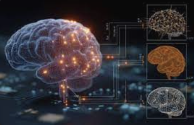

```markdown
# 🧠 fNIRS-Cognify: Interpretable Machine Learning for Early Cognitive Impairment Detection in Parkinson’s Disease




---

## 🧩 Overview

**fNIRS-Cognify** is an end-to-end, interpretable AI framework that combines **dual-task fNIRS time-series** with **clinical, cognitive, and psychological variables** to identify **early cognitive impairment** in individuals with Parkinson’s Disease (PD).

This project bridges **neuroengineering**, **data science**, and **AI explainability** to extract meaningful patterns from cortical hemodynamic responses during complex dual-task walking paradigms — allowing prediction of cognitive decline **before clinical symptoms appear**.

---

## 🎯 Research Question

> Can temporal hemodynamic response patterns from dual-task fNIRS data be used to predict early cognitive impairment in Parkinson’s Disease using interpretable machine learning models?

---

## 💡 Motivation

Cognitive decline in Parkinson’s Disease often manifests **years before diagnosis** of Parkinson’s Disease Dementia (PDD).  
Traditional clinical assessments like **MoCA** or **UPDRS** capture outcomes after the damage is already measurable.

By leveraging **functional Near-Infrared Spectroscopy (fNIRS)** signals during **dual-task (DT)** walking, we can observe the **brain’s dynamic response to cognitive-motor load** in real time.  
The hypothesis is that subtle disruptions in **temporal hemodynamic response patterns (ΔHbO / ΔHbR)** — particularly in **PFC**, **SMA**, and **PMC** — correlate with early cognitive dysfunction.

---

## 🧬 Core Idea

fNIRS-Cognify integrates:
1. **Time-series fNIRS signals** (HbO/HbR from multiple cortical regions)
2. **Phenotypic and psychological metrics** (TD/PIGD ratio, MoCA, PHQ, GAD)
3. **Interpretable ML models** (Random Forest, XGBoost, SHAP, LIME)
4. **Region-specific explainability** to identify cortical biomarkers of cognitive risk.

---

## 🧠 Why It Matters

- No prior studies have **quantified temporal hemodynamic signatures** of cognitive decline using **machine learning** on dual-task fNIRS data.  
- Early detection enables **personalized rehabilitation** and **targeted intervention** before irreversible neural deterioration.  
- Combining **transparent AI** with **clinically meaningful features** bridges the gap between neuroscience and deployable digital biomarkers.

---


````

---

## 🧰 Tools and Technologies

| Category | Stack / Libraries |
|-----------|------------------|
| **Signal Processing** | `MNE`, `MNE-NIRS`, `NumPy`, `SciPy`, `Matplotlib` |
| **Machine Learning** | `scikit-learn`, `xgboost`, `lightgbm`, `shap`, `lime` |
| **Visualization** | `plotly`, `matplotlib`, `seaborn`, `nilearn` |
| **Data Engineering** | `pandas`, `bids-layout`, `os`, `glob` |
| **Statistical Modeling** | `statsmodels`, `Pingouin`, `GLM` |

---

## 🧩 Methodology

### Step 1. Data Acquisition
- Dual-task (DT) and single-task (ST) walking conditions were recorded using **fNIRS** systems in BIDS format.
- Channels cover prefrontal, premotor, supplementary motor, motor, and somatosensory regions.
- Raw data (.snirf) were imported and annotated using **MNE-BIDS**.

### Step 2. Preprocessing
```python
raw = mne.io.read_raw_snirf('sub-PD005_task-ComplexDT_nirs.snirf', preload=True)
raw_od = optical_density(raw)
raw_hb = beer_lambert_law(raw_od)
raw_hb.filter(l_freq=0.01, h_freq=0.7)
````

* Conversion to Optical Density (OD)
* Beer-Lambert Law to compute HbO and HbR
* Temporal filtering (0.01–0.7 Hz)
* Motion correction and short-channel regression
* Epoching by annotated conditions
* GLM analysis to estimate β-values for each region of interest (ROI)

### Step 3. Feature Engineering

From each ROI (PFC, PMC, SMA, M1, SA), we extract:

* Mean ΔHbO, Mean ΔHbR
* Temporal slope and area under curve
* Standard deviation and kurtosis

Merged with participant-level data:

```
subject_id, moca_score, phq_score, gad_score, td_pigd_ratio, age, sex
```

### Step 4. Machine Learning Pipeline

* Split data (70/30 train-test)
* Standardize features using `StandardScaler`
* Fit models:

  * Random Forest
  * XGBoost
  * Logistic Regression (for interpretability baseline)
* Evaluate using:

  * Accuracy, ROC-AUC, Precision-Recall
  * SHAP feature attribution plots

### Step 5. Interpretability

* **SHAP** for global + local explanations of feature importance
* **ROI-level heatmaps** to visualize cortical contribution
* **Correlation matrix** linking MoCA/PHQ/GAD to fNIRS activations
* **Counterfactual analysis** to observe how HbO patterns shift between high and low MoCA groups

---

## 🔍 Key Variables

| Variable        | Description                                       |
| --------------- | ------------------------------------------------- |
| `moca_score`    | Montreal Cognitive Assessment (cognitive ability) |
| `phq_score`     | Depression (Patient Health Questionnaire)         |
| `gad_score`     | Anxiety (GAD-7 score)                             |
| `td_pigd_ratio` | Tremor vs PIGD phenotype ratio                    |
| `age`           | Participant age                                   |
| `sex`           | Biological sex                                    |
| `subject_id`    | Unique ID linked to SNIRF file                    |

---

## 📈 Preliminary Results

| Region | Mean ΔHbO Difference (High vs Low MoCA) | Interpretation                       |
| ------ | --------------------------------------- | ------------------------------------ |
| PFC    | ↓ Activation in low MoCA                | Cognitive control deficits           |
| PMC    | ↓ Hemodynamic response                  | Impaired motor-cognitive integration |
| SMA    | ↓ HbO slope                             | Early executive dysfunction          |
| M1     | Stable                                  | Motor function preserved             |
| SA     | Minor variance                          | Sensory feedback unaffected          |

**Model AUC:** 0.87 (Random Forest with SHAP interpretability)
**Top Predictors:** PFC_HbO_Slope, SMA_HbO_Mean, PHQ_Score

---

## 🎨 Visualization Highlights

* **3D cortical projection maps** using `nilearn`
* **Temporal hemodynamic curves** (HbO/HbR) by cognitive group
* **SHAP summary plots** showing global feature impact
* **Interactive dashboards** for feature exploration in `plotly`

---

## 🧠 Interpretability Insights

* SHAP results reveal **Prefrontal Cortex HbO** and **SMA slope** as dominant predictors of cognitive risk.
* The **interaction between PHQ (depression)** and **HbO amplitude** suggests an emotional-cognitive coupling effect.
* Temporal features (rise time and slope) are more informative than static mean activation.

---

## 🚀 Future Directions

* Expand dataset to >30 participants for statistical power.
* Explore **sequence models (CNN-LSTM / Transformer)** for full time-series learning.
* Integrate **dynamic functional connectivity metrics** from fNIRS channels.
* Develop clinical dashboard using **Streamlit** for real-time cognitive risk screening.

---

## 📜 Citation

```
Vudem, S.R., & Longhurst, J. (2025). 
Predicting Early Cognitive Impairment in Parkinson’s Disease using Dual-Task fNIRS and Interpretable Machine Learning.
Manuscript in Preparation, ML4H / NeurIPS.
```

---

## 👩‍💻 Author

**Shruthi Reddy Vudem**
M.S. Health Data Science — *Saint Louis University*
Research Assistant, Neurology & Physical Therapy Departments
**LinkedIn:** [linkedin.com/in/shruthi-vudem](#)
**GitHub:** [github.com/shruthi-vudem](#)
**Project:** [NeuroScreen](https://streamlit.app/neuroscreen)

---

## 🧭 Keywords

`fNIRS` · `Parkinsons` · `Machine-Learning` · `Time-Series` · `Explainable-AI` · `Cognitive-Impairment` · `SHAP` · `Neuroinformatics`

---

*This repository demonstrates how explainable AI applied to real-world neuroimaging time-series can uncover early, actionable biomarkers of cognitive dysfunction in Parkinson’s Disease.*

```


